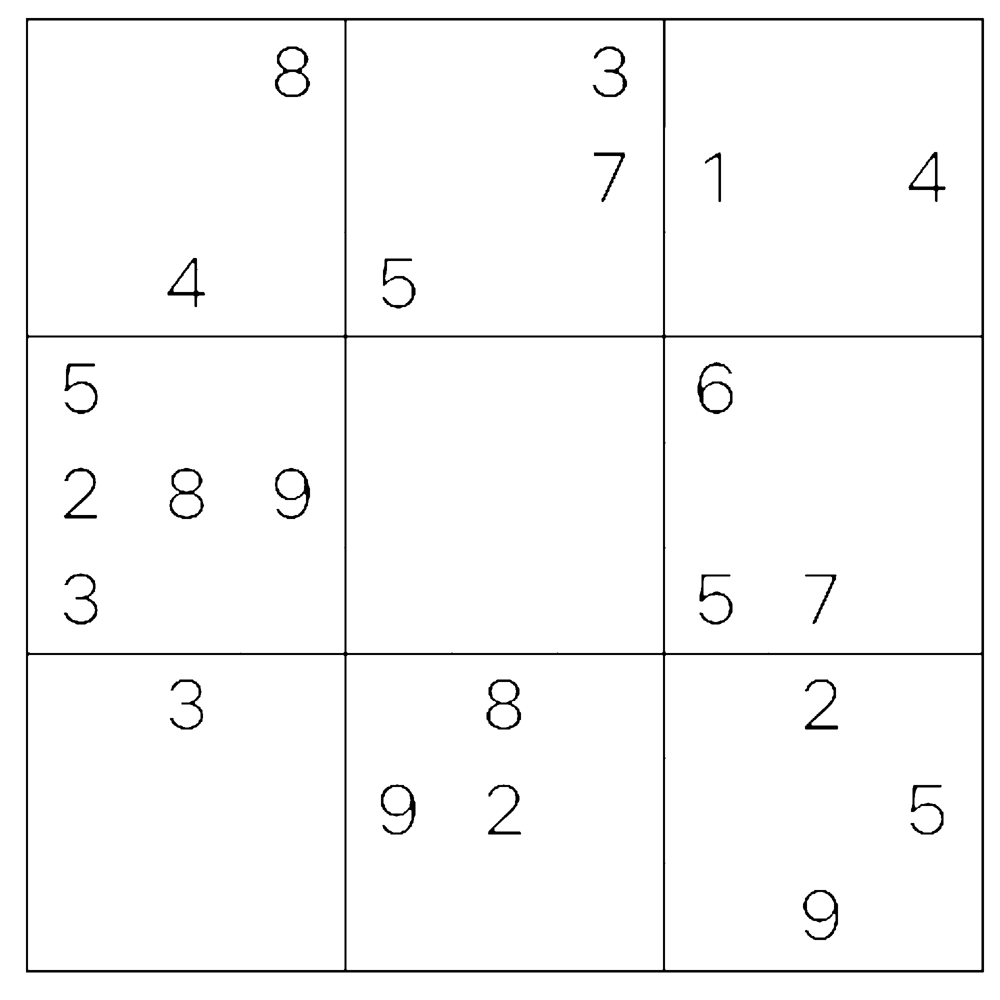
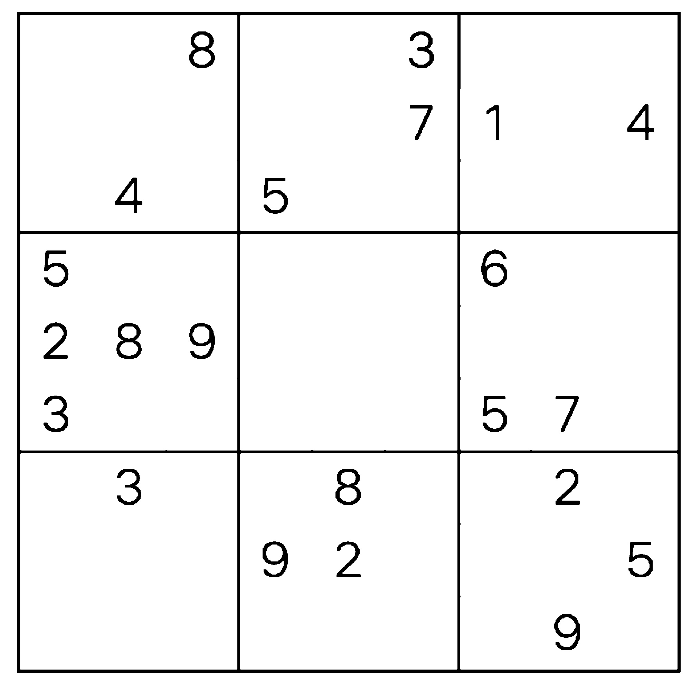
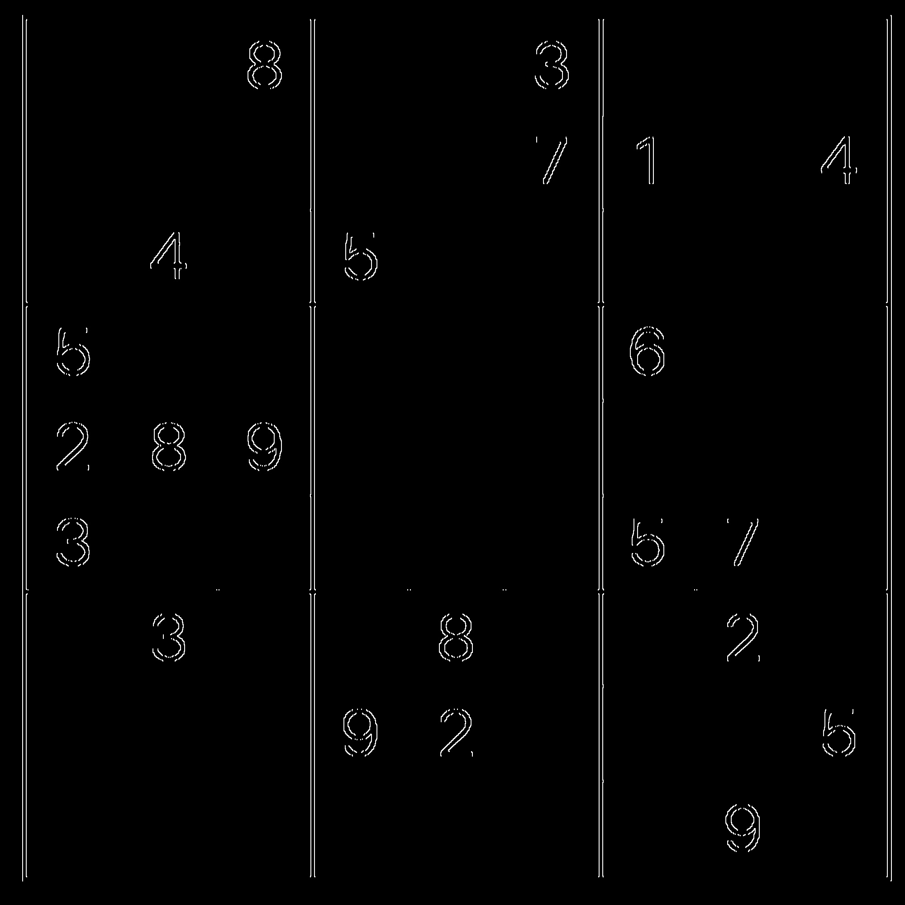
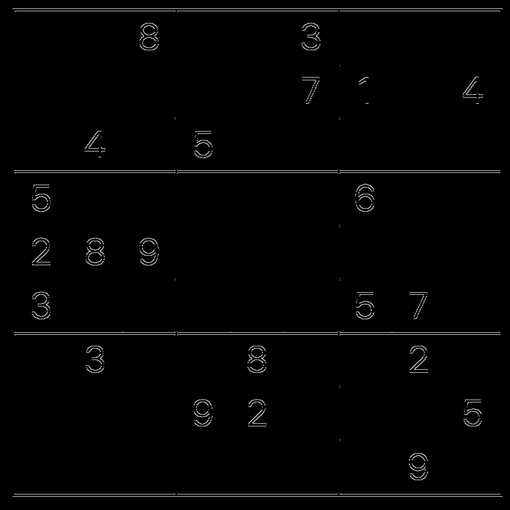
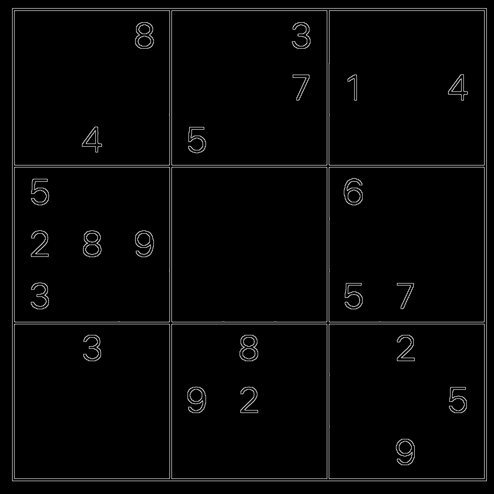
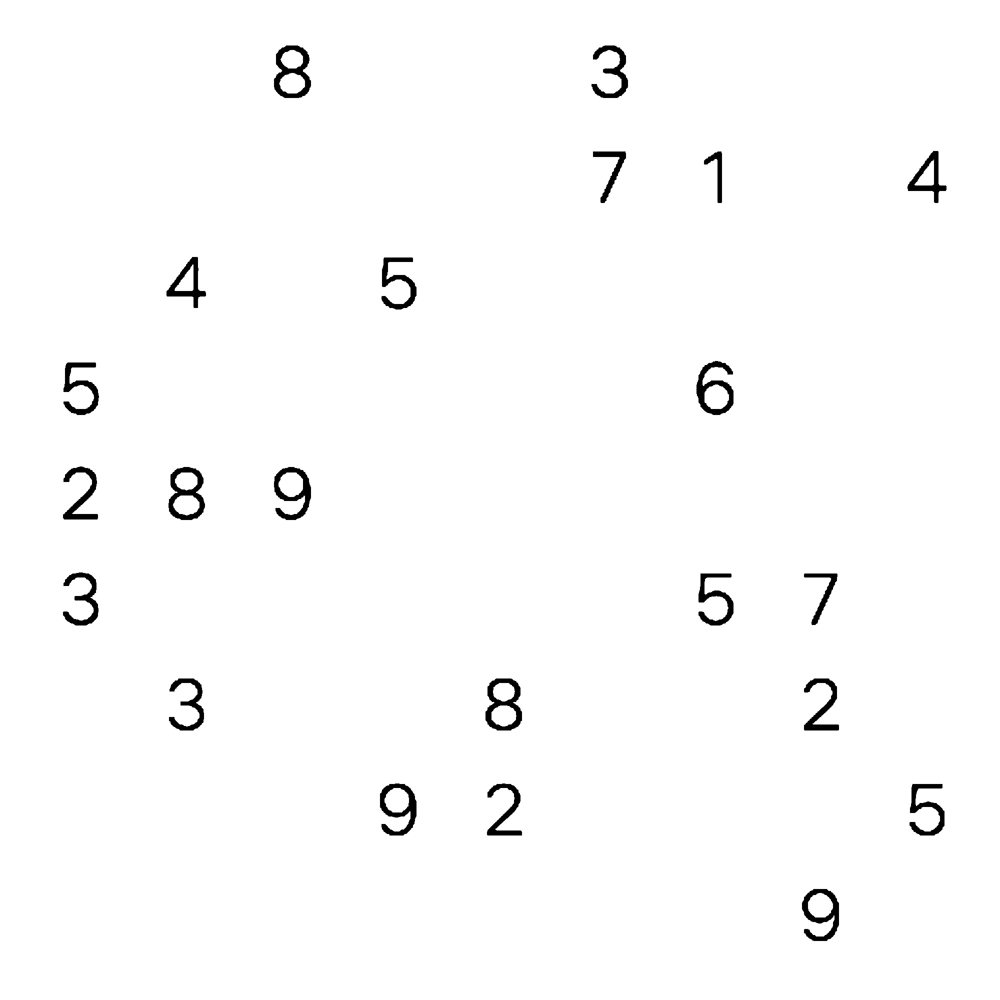

## 說明
    可以對數獨題目的照片進行影像分析，並分析出答案
    詳情請參見Group3 SudoAnswer

## 操作說明
1. 程式入口：main.py
2. 在與main.py同目錄下會生成圖片經過不同處理時的結果
    * 二值化：
    

    * 膨脹：
    

    * 侵蝕：
    

    * sobelX：
    

    * sobelY：
    

    * sobelXY：
    

    * 擦除邊框後效果：
    

3. demo影片：
    

## 依賴
* numpy
* cv2 (opencv-python)
* PIL
* ddddocr